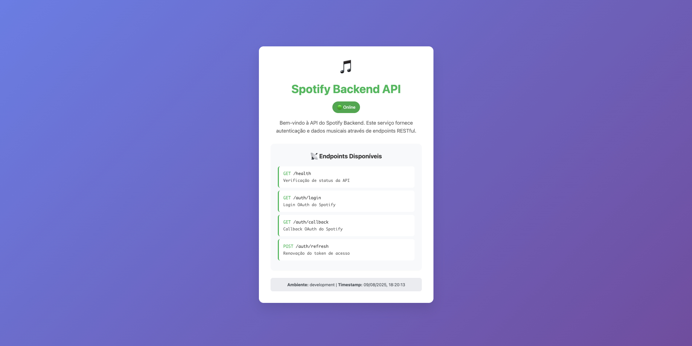

# Spotify Backend API

A Node.js backend service that provides Spotify OAuth authentication and musical data through RESTful endpoints.



## 🚀 Features

- **Spotify OAuth Integration** - Secure authentication with Spotify's API
- **RESTful API** - Clean, standardized endpoints for easy integration
- **TypeScript** - Full type safety and modern JavaScript features
- **Comprehensive Testing** - Unit, integration, and E2E test coverage
- **Code Quality** - ESLint, Prettier, and SonarQube integration
- **Docker Support** - Containerized deployment ready

## 📋 Prerequisites

- Node.js 18+
- npm or yarn
- Spotify Developer Account
- Spotify App credentials

## 🛠️ Installation

1. **Clone the repository**

   ```bash
   git clone <repository-url>
   cd spotify-backend
   ```

2. **Install dependencies**

   ```bash
   npm install
   # or
   yarn install
   ```

3. **Environment Setup**
   Create a `.env.local` file with your Spotify credentials:

   ```env
   SPOTIFY_CLIENT_ID=your_spotify_client_id
   SPOTIFY_CLIENT_SECRET=your_spotify_client_secret
   SPOTIFY_REDIRECT_URI=frontend-url/auth/callback
   ```

4. **Run Setup Script**
   ```bash
   npm run setup
   ```

## 🚀 Usage

### Development

```bash
npm run dev
```

### Production

```bash
npm run build
npm start
```

### Testing

```bash
# Run all tests
npm test

# Unit tests only
npm run test:unit

# E2E tests
npm run test:e2e

# Watch mode
npm run test:watch

# Coverage report
npm run test:coverage
```

## 📡 API Endpoints

| Method | Endpoint         | Description             |
| ------ | ---------------- | ----------------------- |
| `GET`  | `/health`        | API status verification |
| `GET`  | `/auth/login`    | Spotify OAuth login     |
| `GET`  | `/auth/callback` | Spotify OAuth callback  |
| `POST` | `/auth/refresh`  | Access token renewal    |

## 🏗️ Project Structure

```
src/
├── config/          # Configuration files
├── controllers/     # Request handlers
├── middleware/      # Express middleware
├── routes/          # API route definitions
├── services/        # Business logic
├── types/           # TypeScript type definitions
└── utils/           # Utility functions
```

## 🧪 Testing

The project includes comprehensive testing with Jest:

- **Unit Tests**: Individual component testing
- **Integration Tests**: API endpoint testing
- **E2E Tests**: Full workflow testing
- **Test Coverage**: Detailed coverage reports

## 🔧 Development Tools

- **ESLint** - Code linting and style enforcement
- **Prettier** - Code formatting
- **Husky** - Git hooks for quality assurance
- **SonarQube** - Code quality analysis

## 🐳 Docker

Build and run with Docker:

```bash
# Build image
docker build -t spotify-backend .

# Run container
docker run -p 3000:3000 spotify-backend
```

## 📝 Scripts

- `npm run dev` - Start development server
- `npm run build` - Build for production
- `npm run start` - Start production server
- `npm run test` - Run all tests
- `npm run lint` - Check code quality
- `npm run format` - Format code with Prettier

## 🤝 Contributing

1. Fork the repository
2. Create a feature branch
3. Make your changes
4. Run tests and linting
5. Submit a pull request

## 📄 License

This project is licensed under the MIT License.

## 🔗 Links

- [Spotify Developer Documentation](https://developer.spotify.com/documentation)
- [Express.js Documentation](https://expressjs.com/)
- [TypeScript Documentation](https://www.typescriptlang.org/)
